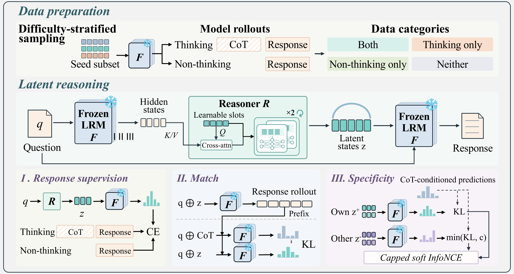

# ThinkBridge

ThinkBridge trains a lightweight latent reasoner **R** with a frozen language model **F**. It supports **Qwen3-0.6B** and **Qwen3-4B**.



R reads the question's final-layer hidden states through cross-attention from 64 learnable slots. Two independent Transformer layers execute in the shared order `0 → 1 → 0 → 1`. The resulting latent states z condition F when it generates an answer.

R combines response cross-entropy, forward-KL matching to CoT-conditioned predictions, and question-specific contrastive supervision. Match uses the model's stopped answer prefix. Specificity uses same-question positives, different-question negatives, detached similarity weights, and capped negative KL. Each component retains its own population and optimizer-window normalization. Native CoT supervises training; inference needs only the question, F and R.

F, token embeddings and the vocabulary head remain frozen. Trainable R parameters and Adam states are FP32; CUDA computation uses BF16 autocast.

## Installation

Use Linux x86_64, Python 3.10 or newer, a CUDA 12.9 toolkit and a compatible NVIDIA driver. From the repository root, in your chosen Python environment:

```bash
bash scripts/install.sh
think-bridge --help
```

The installer pins PyTorch 2.11.0, Transformers 5.12.1, vLLM 0.23.0 and DeepSpeed 0.17.6. It does not install or modify the NVIDIA driver. For an already configured environment, `python -m pip install .` installs the package and its core dependencies. `pip install -e .` supports development. vLLM and DeepSpeed are optional training dependencies. Model configuration files are included in the wheel.

## Workflow and paths

All example scripts resolve paths from the repository root, including when invoked from another directory.

| Input/output | Default |
| --- | --- |
| Raw train / validation QA | `data/raw/train.json`, `data/raw/validation.json` |
| Prepared model-specific inputs | `data/stage0/0.6B/` or `data/stage0/4B/` |
| Model | `Qwen/Qwen3-0.6B` or `Qwen/Qwen3-4B`, through the HF cache |
| Training runs | `outputs/qwen3-0.6b/reasoner-sft/` or `outputs/qwen3-4b/reasoner-sft/` |
| Evaluation outputs | `outputs/qwen3-0.6b/evaluation/<timestamp>-<pid>/` (corresponding path for 4B) |
| Default independent benchmark | `data/benchmark_dataset/gsm_test.json` |

After supplying the full training and held-out validation QA files:

```bash
bash examples/prepare_stage0.sh 0.6B
bash examples/train_reasoner_0.6b.sh
bash examples/evaluate.sh
```

Preparation uses one GPU. Default R training uses GPUs 0–3 for the frozen vLLM service and GPUs 4–7 for training. Evaluation resolves the selected checkpoint from the latest completed R run; set `REASONER_CHECKPOINT` to select a checkpoint or completed run explicitly.

For 4B, use `bash examples/prepare_stage0.sh 4B`, `bash examples/train_reasoner_4b.sh`, then `MODEL_SIZE=4B bash examples/evaluate.sh`. Evaluation scripts use environment settings, not positional arguments.

Defaults live in `scripts/runtime.sh`. `BASE_MODEL_DIR`, `RAW_DATA_ROOT`, `DATA_ROOT`, `BENCHMARK_DATA_DIR` and `OUTPUT_ROOT` override the roots/model. `TRAIN_SOURCE`, `VALIDATION_SOURCE` and `TEST_DATASET` override individual inputs. Export a setting when it should apply across stages. No dataset is automatically downloaded or split.

## Data

Training data is bundled as **Stage0 and Stage1 examples only**; the benchmark test files are bundled in full. Full training data remains outside this release. See [data/README.md](data/README.md) for counts and scope.

```text
data/
├── stage0/examples/{Qwen3-0.6B,Qwen3-4B}/native.json
├── stage1/examples/{Qwen3-0.6B,Qwen3-4B}/
│   ├── native.json
│   ├── behavior.json
│   ├── direct.json
│   ├── validation.json
│   └── validation_behavior.json
└── benchmark_dataset/*_test.json
```

Each model's Stage0 sample contains eight question groups with all eight paired rollouts (64 records). Stage1 examples reuse those same rollouts, add matching real behavior/direct records, and include eight held-out questions with their real validation behavior. These are format examples, not the full training population; default launchers never substitute them for missing full data. Example envelopes describe the subset rather than claiming the parent dataset's counts or fingerprint. The retained generation and label records are not synthesized.

The benchmark directory includes the five single-turn tests (GSM, GSM-Hard, MATH-500, MultiArith, SVAMP) and the MathChat multi-turn test data. The public evaluator supports the five single-turn tests and the three-turn MathChat follow-up protocol. Dataset rights remain with their upstream owners.

Each native record contains:

| Fields | Meaning |
|---|---|
| `question`, `answer`, `id` | Question, reference answer, and stable question identity |
| `cot`, `self_answer`, `rollout_idx` | CoT and answer from the **same** native rollout |
| `correct`, `answer_correct`, `n_sampled`, `n_correct`, `bucket` | Original judgments and complete-group counts |
| `generation_model`, `generation_backend`, `generation_executor_artifact_sha256` | Generation model and recorded artifact provenance |
| `generation_seed`, `generation_temperature`, `generation_top_p`, `generation_max_new_tokens` | Original sampling settings |
| `finish_reason`, `generated_token_count`, `think_closed`, `generation_complete` | Completion and truncation evidence |

Do not synthesize missing provenance, change labels, combine a CoT with another rollout's answer, or treat the sample subset as a complete evaluation set.

For full training, supply your complete, matching data artifacts in this layout for each model size:

```text
data/stage0/0.6B/                # use 4B/ for Qwen3-4B
├── native.json                 # complete paired native rollouts
├── behavior.json               # frozen-model training behavior manifest
├── direct.json                 # exact greedy direct-answer outputs
├── validation.json             # held-out question / answer records
└── validation_behavior.json    # matching generated validation behavior
```

Full training and training-validation datasets are not bundled or automatically downloaded. Obtain the underlying questions under their applicable terms and explicitly choose disjoint training and validation splits. To generate the complete artifact set on one CUDA GPU:

```bash
bash examples/prepare_stage0.sh 0.6B
```

For 4B, run `bash examples/prepare_stage0.sh 4B`. The wrapper reads the default raw train/validation paths and writes the corresponding model-specific Stage0 directory. Input JSON arrays or JSONL contain `question`, `answer`, and preferably stable `id` values. Validation may contain any nonzero number of held-out questions; the command rejects duplicate questions and exact normalized overlap with training. Semantic overlap still requires an upstream split audit. Gold CoT is not required. The output directory must be new: existing Stage0 artifacts are never overwritten.

Preparation runs three separate processes in order: (1) eight native paired rollouts per training question, temperature 1, top-p 1, seed 42, 8192 generated tokens; (2) exact greedy HF direct answers and training behavior, with native success derived from those immutable rollouts; (3) greedy HF native/direct validation behavior. The native backend defaults to vLLM; `--backend hf` explicitly selects HF instead. Behavior uses HF in both cases. The direct budget is 2048 tokens and validation native budget is 8192. Generation retains wrong, incomplete, and capped attempts and their observed token streams; it never resamples until success. `--no-progress` disables progress bars.

The lower-level `sample-native-rollouts` and `precompute-behavior` commands expose the same stages for explicit GPU sharding or recovery into new output locations; see their `--help`. Existing behavior can only be reused with `--reuse_if_valid` after source, decoding, backend, and frozen-model checks. Partial or conflicting final artifacts require a new location, not automatic repair.

The training readers use these data formats:

- `native.json` is a JSON array of paired rollouts. Group counts and rollout indices must agree with the recorded labels.
- `behavior.json` and `validation_behavior.json` contain a `prompts` array with prompt/reference bindings, native/direct correctness labels, and available native token observations.
- `direct.json` contains a `records` array with the question, reference answer, direct prompt binding, generated text/token IDs, EOS status, and correctness judgment.

Producer metadata, a particular file order, and research-specific group IDs are not required for these readers. Question/answer bindings, label consistency, and valid token targets are checked so that one question cannot accidentally train on another question's answer. The preparation commands write the fuller provenance format automatically.

Validation is separate from training and may be small. Failed native generations can retain observed reasoning lengths for donor matching. If that observation is unavailable, validation uses prompt length for matching and does not invent a CoT or a native target. The training examples evaluate up to 500 questions by default; set `MAX_EVAL_SAMPLES` to change that limit. The dataset need not contain 500.

Compiled targets are cached by input contents and rebuilt when inputs change. Moving unchanged files preserves their content identity. Newly generated artifacts also record frozen-executor provenance; recorded model proofs are checked against the selected F. Keep the model/tokenizer revision consistent with the prompts and generated targets.

## Train R

The two model-specific scripts take no positional arguments. `examples/train_reasoner_0.6b.sh` and `examples/train_reasoner_4b.sh` expose settings and comments; `scripts/train_reasoner.sh` contains shared launch logic.

R defaults to **two epochs**, with checkpoint selection by free-generation validation true-z answer accuracy. Each run saves `best_reasoner_checkpoint.txt`. Training validation retains singleton R and its own F decoding batch; independent evaluation batch settings do not change training.

`BATCH_SIZE` is the physical batch per training GPU. Effective batch is `BATCH_SIZE × number of training GPUs × GRADIENT_ACCUMULATION_STEPS`. Service GPUs are excluded.

| R model/backend | Physical batch | Training GPUs | GA | Effective batch |
| --- | ---: | ---: | ---: | ---: |
| 0.6B, vLLM | 16 | 4 | 2 | 128 |
| 4B, vLLM | 4 | 4 | 8 | 128 |
| 0.6B, torch | 16 | 8 | 1 | 128 |
| 4B, torch | 4 | 8 | 4 | 128 |

Set `STAGE1_GENERATION_BACKEND=torch` for the eight-GPU torch defaults. `TRAIN_GPUS`, `VLLM_GPUS`, `BATCH_SIZE` and `GRADIENT_ACCUMULATION_STEPS` are explicit overrides. Adjust batch and GA together when changing GPU count. The 0.6B template uses DDP; 4B uses DeepSpeed ZeRO-1. Gradient checkpointing is disabled by default. `REASONER_EPOCHS` changes the training budget; `NO_PROGRESS=1` disables progress bars.

R training and deployment keep the same latent architecture. Checkpoints include R's trainable parameters, fixed state, tokenizer and frozen-F identity; training checkpoints also include optimizer, scheduler, RNG and sampler state. Keep the complete checkpoint directory and run metadata when relocating a run. Exact training resume checks these states before continuing.

## Training losses and logs

R uses `L = CE_WEIGHT * loss_ce + MATCH_WEIGHT * loss_match + SPECIFICITY_WEIGHT * loss_specific`; all three weights default to 1. Response CE supervises answer tokens. Match uses forward KL to the frozen CoT-conditioned teacher. Specificity compares same-question positives with different-question negatives, with detached similarity weights and capped negative KL. Each component uses its own eligible population and optimizer-window normalization; only R is updated.

The progress bar shows completed/total updates, speed, elapsed time, ETA and current total loss. The terminal log reports total loss, `loss_ce`, `loss_match`, `loss_specific`, pre-clipping gradient norm, learning rate, epoch, memory and throughput. Training records summarize the logging window: every 10 optimizer updates by default, plus the first update and epoch ends. Validation and checkpoints run every 50 updates and at the end of training. Validation `true_z_full_accuracy` selects the best checkpoint.

Under `outputs/qwen3-0.6b/reasoner-sft/` (or `qwen3-4b`):

- `latest.log` points to the latest invocation's complete terminal log.
- Each `run-<index>-<timestamp>/logging.jsonl` stores structured training, validation and checkpoint events.
- `step_audit.jsonl` stores detailed update statistics at logging points.
- `resolved_config.json` stores the actual run settings; `reports/` contains validation reports.
- `best_reasoner_checkpoint.txt` identifies the selected checkpoint.

The current trainer writes terminal and JSONL logs; it does not write TensorBoard event files. Use `NO_PROGRESS=1` to disable the progress bar while retaining logs.

## Evaluation

| Script | Purpose |
| --- | --- |
| `examples/evaluate.sh` | HF single-turn answer accuracy and an optional multi-turn ACC + TTFT block |
| `examples/evaluate_ttft.sh` | HF single-turn TTFT, or multi-turn ACC + TTFT |
| `examples/evaluate_vllm.sh` | Single-GPU vLLM single-turn answer accuracy |

```bash
# HF single-turn answer accuracy.
bash examples/evaluate.sh
# Also run multi-turn from complete question/response histories.
RUN_MULTITURN=1 bash examples/evaluate.sh
# Only multi-turn.
RUN_SINGLE_TURN=0 RUN_MULTITURN=1 bash examples/evaluate.sh
# Single-turn TTFT: default batch 1; larger concurrent batches supported.
bash examples/evaluate_ttft.sh
TTFT_BATCH_SIZE=8 bash examples/evaluate_ttft.sh
# Multi-turn ACC and TTFT from the same complete answers.
MODE=multi-turn bash examples/evaluate_ttft.sh
# Single-GPU vLLM answer accuracy.
bash examples/evaluate_vllm.sh
```

Set `MODEL_SIZE=4B` for the 4B model. Single-turn uses `EVAL_GPU=0` by default. Accuracy uses R batch 64 and HF answer batch 16, controlled independently by `REASONER_BATCH_SIZE` and `ANSWER_BATCH_SIZE`. Metrics are per question. Duplicate prompts may reuse z, but all benchmark rows retain their metric weight. Tail batches use the actual number of rows.

Multi-turn uses **response_only**: all previous user questions and complete generated F replies remain verbatim in the next input. Both F and R see full history plus the current question. Every turn computes fresh z; latent states are not carried across turns. Gold answers and future questions are never model inputs. Context overflow is reported without silent truncation. There is no multi-turn training entrance.

Multi-turn defaults to `EVAL_GPUS=0,1,2,3,4,5,6,7`, one independent HF replica per GPU. R remains singleton. F batch per GPU is 16 for 0.6B or 8 for 4B; `MULTITURN_BATCH_SIZE` overrides it, including batch 1. Whole conversation groups are assigned to replicas. Results merge in original order and metrics are computed from all rows, not rank means. The default multi-turn dataset is `data/benchmark_dataset/mathchat_follow_up_test.json`.

Single-turn TTFT defaults to `TTFT_BATCH_SIZE=1` and supports larger F batches while R remains singleton. Each row records its first actual response token and stops independently at that token. No answer ACC is reported for these truncated outputs. Thinking/control tokens are excluded; EOS-only or capped requests without an actual response are censored. Latency includes input preparation, F/R computation and F prefill. It is never computed as batch time divided by batch size.

Multi-turn TTFT continues full generation: the same answers provide ACC and subsequent history. Next-turn arrival is the preceding full answer batch completion plus the optional inter-turn delay (default zero). History/input preparation after arrival is included. Singleton and batched-load latency carry distinct timing contracts, with configured and actual tail sizes. Loading, startup, two warmups and CPU judging are excluded.

vLLM single-turn defaults to one GPU, DP=1, TP=1, answer batch 8, eager execution and `VLLM_GPU_MEMORY_UTILIZATION=0.50`. HF F/R and a separate vLLM F copy share that GPU; the memory fraction refers to total GPU memory. Leave room for both weights and HF activations. Adjust the fraction and batch sizes to the GPU. z enters vLLM as embeddings with the same thinking boundary.

Use `TEST_DATASET` or `MULTITURN_DATASET` to select data and `EVAL_OUTPUT_DIR` to select a new output root. CPU tiny-model validation does not establish CUDA memory fit, eight-GPU performance or vLLM throughput.

The lower-level `think-bridge eval` provides true/wrong/zero latent controls. Wrong-z excludes matching prompts and supplied identities, uses up to eight available distinct donors, then averages donors within each question before averaging questions. Zero-z preserves all 64 slots. Answer judging is shared with training validation and benchmarks. These diagnostics do not change checkpoint selection.

## Inference

```bash
MODEL_SIZE=0.6B
source scripts/runtime.sh
R_CHECKPOINT="$(resolve_checkpoint_source "" "$REASONER_PROJECT_DIR" reasoner-sft route1)"
think-bridge infer --model "$BASE_MODEL_DIR" \
  --reasoner_checkpoint "$R_CHECKPOINT" --question 'What is 17 plus 25?'
```

`--local_files_only` prevents downloads; `--local_device cpu` supports tiny-model development checks. Inference loads R's saved geometry/fixed state and the checkpoint tokenizer, and validates the frozen model identity.

## License and acknowledgments

The code uses the Apache License 2.0 in [LICENSE](LICENSE). Model weights, datasets and dependencies retain their respective licenses. See [Qwen3](https://huggingface.co/Qwen), [Transformers](https://github.com/huggingface/transformers), [PyTorch](https://github.com/pytorch/pytorch), [vLLM](https://github.com/vllm-project/vllm) and [DeepSpeed](https://github.com/deepspeedai/DeepSpeed).
